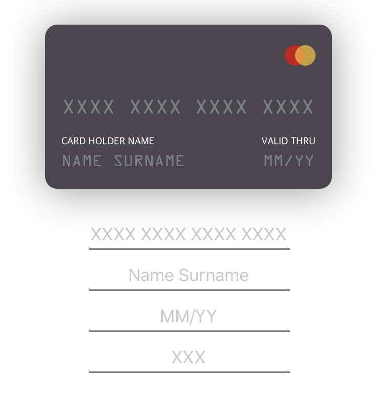
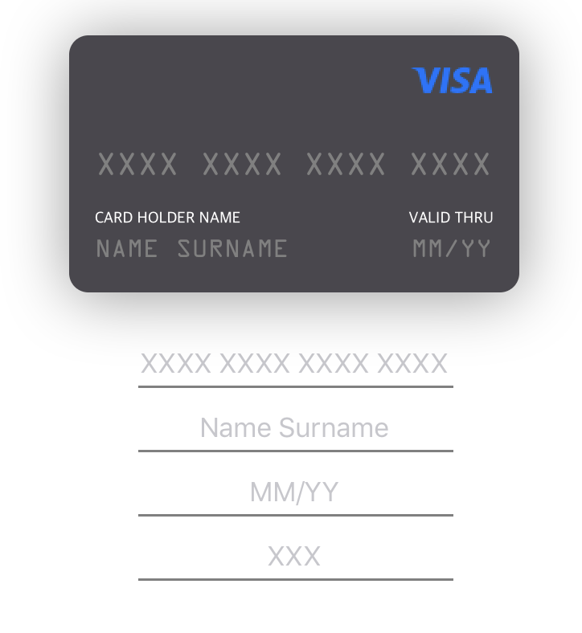
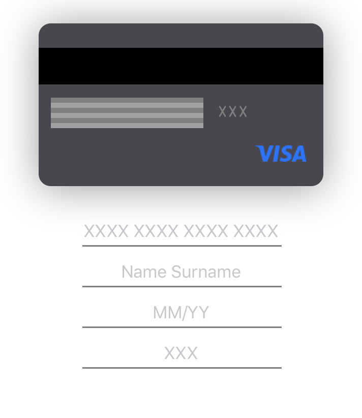

<p align="center">

</p>

## 🎬 Preview
<p align="center">

</p>

## 🌟 Features
- [x] Easily usable
- [x] Simple Swift syntax
- [x] Cool flip animation
- [x] Compatible with `Carthage`
- [x] Compatible with `CocoaPods`
- [x] Customizable
- [x] Universal (iPhone & iPad)
- [x] Lightweight readable codebase
- [x] And More...

## 📲 Installation

#### Using [CocoaPods](https://cocoapods.org)

Edit your `Podfile` and specify the dependency:

```ruby
pod "YRPayment"
```

#### Using [Carthage](https://github.com/carthage)

Edit your `Cartfile` and specify the dependency:

```bash
github "vikingdr/YRPayment"
```

## 🐒 How to use

In **4** steps:

**1.** Import YRPayment.
```swift
import YRPayment
```

**2.** Create a YRPaymentCreditCard instance and link it to a YRPayement instances:
```swift
let card = YRPaymentCreditCard()
let payment = YRPayment(creditCard: card)
```

**3.** Add your card to a view and set its position: 
```swift
view.addSubview(card)
card.centerXAnchor.constraint(equalTo: view.centerXAnchor).isActive = true
card.centerYAnchor.constraint(equalTo: view.centerYAnchor).isActive = true
```
**4.** link your textFields to the payment object: 
```swift
payment.numberTextField = NumberTF
payment.holderNameTextField = NameTF
payment.validityTextField = ValidityTF
payment.cryptogramTextField = cryptoTF
```
> *(Assuming that NumberTF, NameTF, ValidityTF, cryptoTF are textField alrready created)*

**5.** Enjoooooooy ! 
<p align="center">

</p>

## 🔍 Extracting data from the credit card

To extract data from the credit card :

1. Credit card number :
```swift
payment.getCardNumber()
```

2. Credit card holder name :
```swift
payment.getCardHolderName()
```

3. Credit card validity :
```swift
payment.getCardValidity()
```

4. Credit card cryptogram
```swift
payment.getCardCryptogram()
```

## 🎨 Customization : (more features are coming soon)

### 💳 Customizing the credit card type (Symbole):

When creating your creditCard instance (as seen before 👆) MasterCard is default:
```swift
let card = YRPaymentCreditCard()
```
you can specify the symbole you want from the available types:
```swift
let card = YRPaymentCreditCard(type: .masterCard)
```
or specify a custom one by uploading your own image symbole:
```swift
let image = UIImage(named: "mySymboleImage")!
let card = YRPaymentCreditCard(type: .custom(image))
```
<p align="center">
  
  
</p>

> **More types are coming soon**
### 🕹 Enable/Disable flip on user tap:
```swift
// Enable
payment.flipOnClick = true

// Disable
payment.flipOnClick = false
```
<br>
<br>

##  Author

* Matthew James | VikingDR

